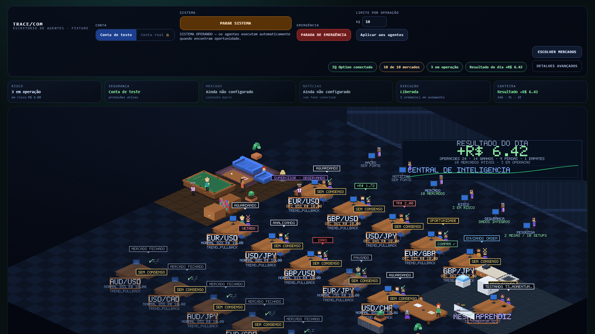
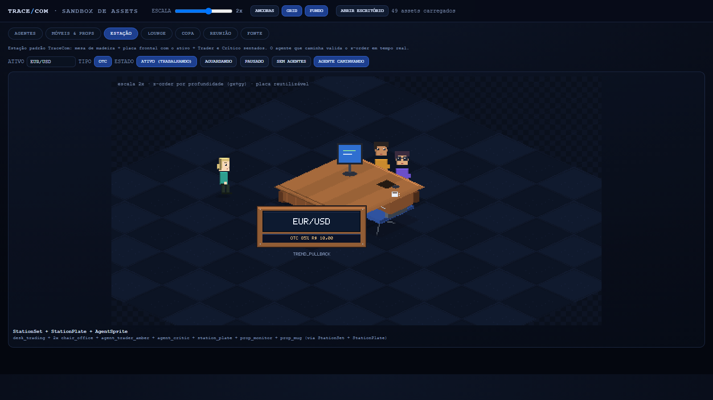
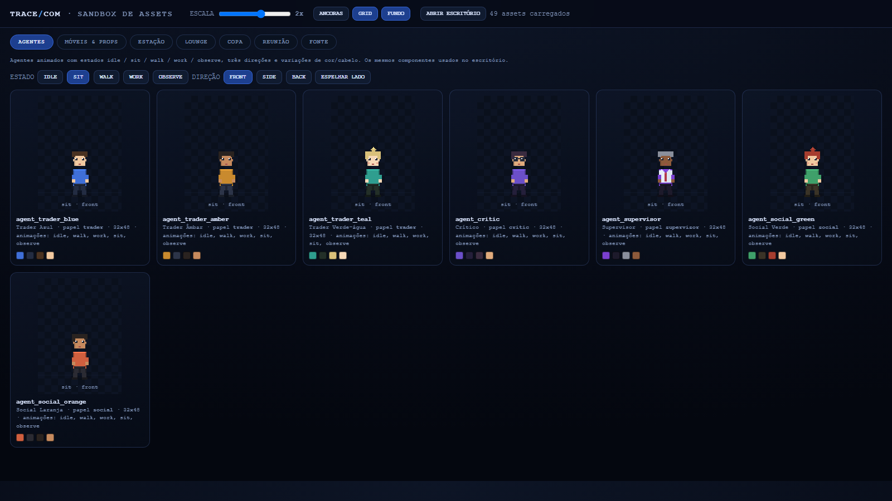
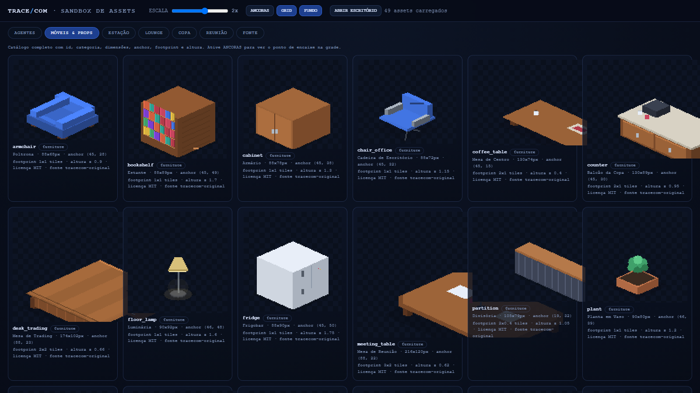

# Escritório TRACE/COM — sistema de assets pixel art

Camada **visual** do Office V3. Nada aqui toca lógica de trading: são PNGs,
manifests JSON, um gerador e componentes de desenho em Canvas 2D.

## Resumo

- **Arte original** (MIT, mesma licença do projeto), gerada de forma reproduzível
  por `scripts/office-assets/generate.mjs`.
- **Inspiração arquitetural/visual:** [pixel-agents-hq/pixel-agents](https://github.com/pixel-agents-hq/pixel-agents)
  (MIT). A linguagem "chibi top-down" vem do pack [JIK-A-4 · MetroCity](https://jik-a-4.itch.io/metrocity-free-topdown-character-pack) (CC0).
  Nenhum arquivo foi copiado: os sprites são recriados em isométrico próprio.
- **Assets carregados em runtime** por `src/http/public/office-assets.js`
  (`AssetManifestLoader` → `OfficeAssetRegistry` → `AgentSprite`/`Sprite`/`StationPlate`…).
- **Sandbox de validação:** `/office-sandbox.html` (agentes, móveis, escala, anchor,
  z-order, composições de estação/lounge/copa/reunião e fonte).

## Screenshots

| | |
| --- | --- |
|  |  |
| Office V3 com assets (fixture) | Sandbox · estação padrão |
|  |  |
| Sandbox · agentes | Sandbox · móveis e props |

## Estrutura

```
src/http/public/assets/office/
  agents/<id>/spritesheet.png + manifest.json   # 12 colunas x 3 linhas, frame 32x48
  furniture/<id>/<id>.png + manifest.json       # móveis isométricos
  props/<id>/...                                # caneca, papéis, monitor, lixeira...
  decor/<id>/...                                # tapete, quadros, relógio, planta pendurada
  floors/<id>/...                               # tiles 84x38 (diamante 1x1)
  walls/<id>/...                                # textura de parede + rodapé
  ui/<id>/...                                   # placas, selos, fonte pixel
  manifests/office-assets.json                  # índice (o loader lê este arquivo)
  manifests/CREDITS.md                          # créditos e licenças
```

### Manifest (campos)

| campo | descrição |
| --- | --- |
| `id` | identificador único (usado pelo renderer) |
| `category` | `agents` / `furniture` / `props` / `floors` / `walls` / `decor` / `ui` |
| `name` | nome legível |
| `source` | `tracecom-original` (ou outra origem, se importado) |
| `license` | licença do asset |
| `file` | PNG dentro da pasta do item |
| `width`/`height` | dimensões do PNG (validadas contra o arquivo real) |
| `anchor` | ponto do PNG que encaixa na grade `iso(gx, gy, gz)` |
| `depthOffset` | ajuste fino de profundidade |
| `states` / `animations` | estados e animações (agentes: `idle`, `walk`, `work`, `sit`, `observe`) |
| `footprint` / `heightZ` | ocupação em tiles e altura em unidades z |
| `notes` | observações de arte |

## Comandos

```bash
npm run office:assets         # regenera PNGs + manifests + índice
npm run office:assets:check   # valida manifests, PNGs, anchors e animações
npm test                      # inclui tests/office-assets.test.ts
```

## Como expandir sem redesenhar nada no código

1. Crie a pasta `assets/office/<categoria>/<id>/` com o PNG e um `manifest.json`
   (copie um existente como base).
2. Registre o caminho em `manifests/office-assets.json` ou rode `npm run office:assets`
   se o asset for gerado pelo script.
3. O loader carrega automaticamente; no renderer use `client.draw(ctx, "<id>", …)`.
4. Valide com `npm run office:assets:check` e abra `/office-sandbox.html`.

## Integração (Office V3)

`office.js` usa os assets quando disponíveis e mantém o desenho procedural como
fallback seguro (se os assets falharem, o escritório continua funcionando):

- estações: `desk_trading` + 2x `chair_office` + `agent_trader_*`/`agent_critic`
  sentados atrás da mesa + `station_plate` com nome do ativo;
- lounge: `rug_lounge`, `sofa`, `coffee_table`, `armchair`, `pool_table`, plantas;
- copa: `counter`, `sink`, `fridge`, `water_cooler`;
- reunião: `meeting_table`, `whiteboard` + agentes sociais;
- parede: `wall_panel_tile`/`wall_trim` + quadro dinâmico de resultado;
- fundo: `floor_office_a/b`, `floor_lounge_wood`, `floor_kitchen_tile`.

A ordem de desenho usa **depth = gx + gy** (com offsets por componente), o que
garante o z-order correto entre mesas, agentes, móveis e paredes.
